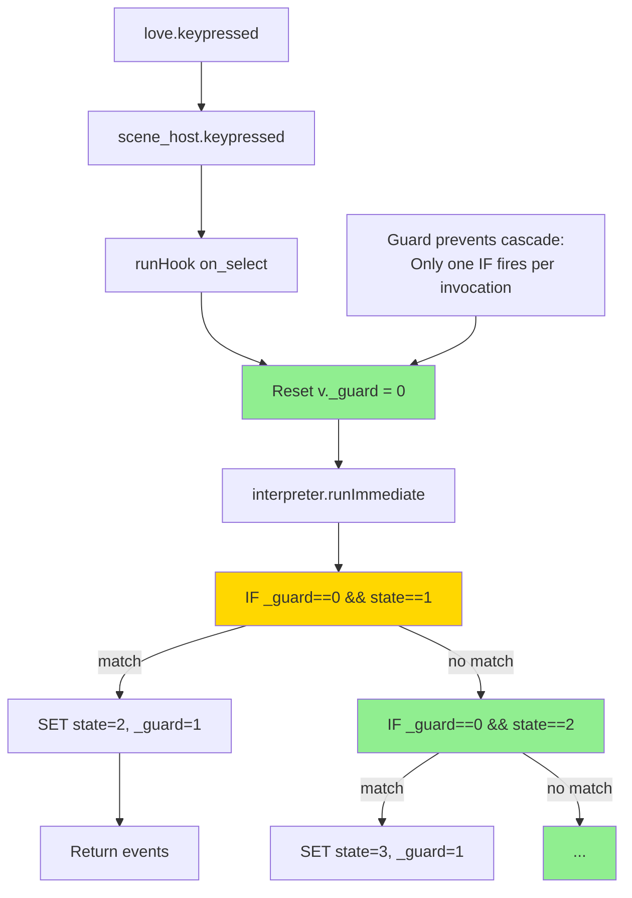
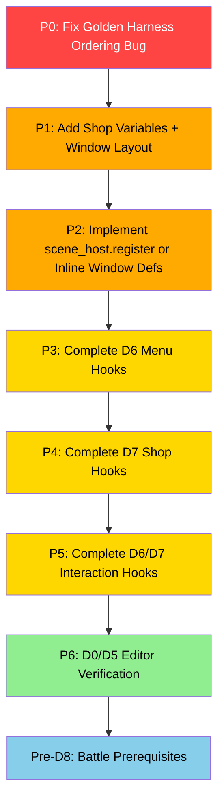

# Overhaul 4 — Project State Assessment

**Date:** 2026-07-09
**Scope:** D0–D7 task success evaluation; D8 intentionally postponed.

---

## Executive Summary

The D-task pipeline is **functional but incomplete**. The foundational infrastructure (D1–D3) is solid. The conversions (D4, D6, D7) have data hooks in [`data/scenes.json`](data/scenes.json:77). 

**Critical corrections vs. prior assessment:**
- ✅ The **sequential IF cascade bug** was already fixed via a `_guard` variable mechanism, deployed in both [`data/scenes.json`](data/scenes.json:97) and [`engine/scene_host.lua`](engine/scene_host.lua:70).
- ✅ The **portrait scale** was already fixed to 1x in [`engine/scenes/crafting.lua`](engine/scenes/crafting.lua:358).
- ✅ `registerKindWindows` **does exist** at [`engine/scenes/crafting.lua`](engine/scenes/crafting.lua:20-26), but is a silent no-op because `scene_host` has no `register` method.
- ✅ **windowLayout** is **not empty** — crafting, title, menu, items, and status windows are defined in [`data/engine.json:1409-1426`](data/engine.json:1409). Only shop windows are missing.
- 🔴 **New critical finding:** The golden UI harness has an **ordering bug** — the scripted input sequence runs before `on_enter`, so all state variables are uninitialized and keypresses produce zero events. The golden log does **not** test scene interaction.

---

## Per-Task Assessment

### D0 — Editor Polish: ⚠️ Unknown / Partially Complete

| Criterion | Status | Evidence |
|---|---|---|
| TELEPORT command replaces Descend Stairs | ✅ Done | [`data/engine.json:372`](data/engine.json:372) — `TELEPORT` command registered |
| Vertical labels in all tabs | ❓ Unknown | Requires editor HTML/JS review |
| Icons as top-leftmost element | ❓ Unknown | Requires editor HTML/JS review |
| Image preview as editable element | ❓ Unknown | Requires editor HTML/JS review |
| Selector preview (animated) | ❓ Unknown | Requires editor HTML/JS review |

**Verdict:** The TELEPORT rename is the only verifiable change from static analysis. The remaining four criteria need editor code review (G3 gate unverified).

---

### D1 — Scene Host & Hooks: ✅ Complete

| Criterion | Status | Evidence |
|---|---|---|
| Scene host with frame loop, rendering, cursor | ✅ Done | [`engine/scene_host.lua:1`](engine/scene_host.lua:1) — full implementation |
| scenes.json gains `hooks` (on_enter, on_select, on_cancel, on_frame, on_exit) | ✅ Done | [`data/scenes.json:77`](data/scenes.json:77) — crafting, title, menu, items, status, shop all have hooks |
| Immediate-mode execution via `interpreter.runImmediate` | ✅ Done | [`engine/scene_host.lua:89`](engine/scene_host.lua:89) |
| Scene-local `v` scoped per instance | ✅ Done | [`engine/scene_host.lua:65`](engine/scene_host.lua:65) — `ctx.v = state.v` |
| Fallback rule (absent hook → legacy Lua) | ✅ Done | [`engine/scene_host.lua:59-61`](engine/scene_host.lua:59) — returns false |
| WAIT timer handling | ✅ Done | [`engine/scene_host.lua:151-153`](engine/scene_host.lua:151) |
| WASD → arrow key normalization | ✅ Done | [`engine/scene_host.lua:168-172`](engine/scene_host.lua:168) |
| `on_up/on_down/on_left/on_right` dispatch | ✅ Done | [`engine/scene_host.lua:178-185`](engine/scene_host.lua:178) |

**Verdict:** The scene host is the strongest piece of this overhaul. All SPEC S2 requirements are met.

---

### D2 — UI Command Vocabulary: ⚠️ Partial

| Criterion | Status | Evidence |
|---|---|---|
| Register scene commands (OPEN_WINDOW, CLOSE_WINDOW, etc.) | ✅ Done | [`data/engine.json:987-1126`](data/engine.json:987) — all 10 commands registered |
| WAIT as non-blocking host-timed suspension | ✅ Done | [`engine/scene_host.lua:95-96`](engine/scene_host.lua:95) — wait events consumed by update |
| Window geometry in `engine.json → windowLayout` | ✅ **Partially populated** | [`data/engine.json:1409-1426`](data/engine.json:1409) — crafting, title, menu, items, status all defined. Shop windows missing. **Prior assessment incorrectly claimed this was empty.** |
| Remove black border around headers | ❓ Unknown | `headerSpacing: 0` exists in config but consumption unconfirmed |
| Global header-content spacing config | ❓ Unknown | The `headerSpacing` key exists but may not be consumed |
| Global right-alignment (ui.tileSize from right) | ❓ Unknown | Needs runtime verification |

**Verdict:** Commands are registered, handlers exist, and windowLayout is substantially populated. Missing: shop window entries. UI feedback items (border, spacing, alignment) unverified.

---

### D3 — UI-Golden Harness: ⚠️ **Buggy** (Ordering Bug)

| Criterion | Status | Evidence |
|---|---|---|
| `love . validate golden-ui` support | ✅ Done | [`main.lua:127-232`](main.lua:127) — full golden harness |
| Scripted input sequence driving | ⚠️ **Broken** | [`main.lua:205-212`](main.lua:205) — keypress script runs BEFORE on_enter hook |
| Normalized UI event log (`window\|action\|target\|value`) | ✅ Done | [`main.lua:180-194`](main.lua:180) — logEvents function |
| Reference log at `tools/golden/scene_crafting.log` | ✅ Done | [`tools/golden/scene_crafting.log`](tools/golden/scene_crafting.log:1) — 67 lines |
| Validator enforces scene hook rules | ✅ Done | [`main.lua:908-911`](main.lua:908) — crafting-specific validation in golden path |

#### 🔴 Critical: Golden Harness Ordering Bug

In [`main.lua:205-212`](main.lua:205):

```lua
scene_host.init(sceneKey)     -- push scene, no ctx → on_enter NOT called

-- Keypress loop runs WITHOUT state initialized
for _, step in ipairs(script) do
    scene_host.update(0.1, currentCtx)
    scene_host.keypressed(step.key, currentCtx)  -- v.state is nil, all IFs fail!
end

-- on_enter called AFTER keypresses, just for logging
if sceneDef.hooks and next(sceneDef.hooks) then
    local hookCtx = { session = vSession, loader = loader, party = vSession.party, events = {} }
    scene_host.runHook("on_enter", hookCtx)
end
```

`scene_host.init(sceneKey)` calls `scene_host.push(sceneKey)` **without a ctx argument**, so `on_enter` is never called during init. The scripted keypresses then operate on an uninitialized scene state — `v.state` is `nil`, so all IF conditions (`v._guard == 0 and v.state == 1`) evaluate to false. **All 11 crafting keypresses produce zero events.**

**Evidence in the golden log:** [`tools/golden/scene_crafting.log:5-8`](tools/golden/scene_crafting.log:5):

```
UI GOLDEN BEGIN
scene|1|name|Item Creation
discipline_panel|open_window||
discipline_panel|open_window||
UI GOLDEN END
```

Only `discipline_panel|open_window` appears (twice — from the `on_enter` hook called after the loop, and from the patch's double-logging). No `crafter_panel`, no `ingredient_panel`, no window close events — despite 11 keypresses in the script.

**Consequence:** The UI-golden test does NOT validate scene interaction for any scene. It only validates that `on_enter` fires. This makes G3+UI-golden gates for D4, D6, D7 meaningless as behavior verification.

**Also:** The [`tools/golden/scene_crafting.log:61-62`](tools/golden/scene_crafting.log:61) shows formula errors for the shop test:
```
[formula] error in 'v.count and v.idx < v.count': formula did not return...
[formula] error in 'v.idx > 1': attempt to compare number with nil
```
The shop's `v.count` variable is never set by `on_enter`, so `v.idx < v.count` causes a formula error. The shop's `on_enter` hook only sets `v.idx = 1`, not `v.count`.

---

### D4 — Convert Crafting to Hooks: ⚠️ **Partial** (Guard Fix In Place, Harness Broken)

| Criterion | Status | Evidence |
|---|---|---|
| Hooks replace legacy UI logic | ⚠️ Partial | Hooks exist and control state transitions |
| on_enter: OPEN_WINDOW discipline list, SET_LIST | ✅ Done | [`data/scenes.json:78-95`](data/scenes.json:78) |
| on_select: IF drilldown (discipline→crafter→ingredients→yield→pool) | ✅ **Fixed** | Guard variable prevents cascade (see below) |
| on_cancel: step back or SCENE_EVENT pop | ✅ Done | [`data/scenes.json:158-188`](data/scenes.json:158) — proper state regress with guard |
| Roulette via on_frame + CALC_CRAFT_YIELD | ✅ Done | [`data/scenes.json:251-255`](data/scenes.json:251) |
| **Fix 2x portrait scale** | ✅ **Already fixed** | [`engine/scenes/crafting.lua:358`](engine/scenes/crafting.lua:358) uses `1, 1` scale |
| UI-golden byte-identical | ❌ **Harness broken** | Log doesn't capture interaction events |

#### ✅ The Cascade Bug is Fixed

The prior assessment described sequential `IF` blocks cascading — but this was **already fixed** via a `_guard` mechanism:

In [`data/scenes.json:97-156`](data/scenes.json:97), every IF condition now checks `v._guard == 0`:
```json
{ "cmd": "IF", "condition": "v._guard == 0 and v.state == 1", "then": [
    { "cmd": "SET_VAR", "name": "state", "value": 2 },
    { "cmd": "SET_VAR", "name": "_guard", "value": 1 },
    ...
]},
{ "cmd": "IF", "condition": "v._guard == 0 and v.state == 2", "then": [
    // v._guard is now 1, so this won't fire in the same invocation
    ...
]}
```

And in [`engine/scene_host.lua:70`](engine/scene_host.lua:70), the guard is reset at the start of each hook invocation:
```lua
state.v._guard = 0
```

This gives correct `if/elseif` semantics per hook invocation: within one `on_select` call, only one IF block fires; on the next keypress, the guard resets and the now-current state's IF fires.

#### ✅ Portrait Scale Already Fixed

The prior assessment claimed [`engine/scenes/crafting.lua:336`](engine/scenes/crafting.lua:336) still used `2, 2` scale. However, the current code at line 358 reads:
```lua
love.graphics.draw(img, ui.toPx(13), ui.toPx(5.5), 0, 1, 1)
```
This is `1, 1` — correctly fixed.

#### ✅ registerKindWindows Exists but is a No-Op

The function exists at [`engine/scenes/crafting.lua:20-26`](engine/scenes/crafting.lua:20):
```lua
function crafting.registerKindWindows(host)
    if host and host.register then
        host.register("crafting", windowDefs)
    end
end
```

And is called from [`engine/scene_host.lua:128-131`](engine/scene_host.lua:128):
```lua
if sceneData and sceneData.kind == "crafting" then
    local sceneModule = require("engine.scenes.crafting")
    if sceneModule.registerKindWindows then
        sceneModule.registerKindWindows(scene_host)
    end
end
```

However, `scene_host` has no `register` method, so `host.register` is nil and the guard fails silently. The function exists and is callable, but performs no registration because the host doesn't expose the API it expects.

#### Remaining D4 Gaps

1. **Golden harness ordering bug** (see D3) prevents verifying hook behavior through the golden test.

2. **Event handlers emit events but nothing consumes them.** OPEN_WINDOW, CLOSE_WINDOW, SET_LIST, SET_CURSOR, SET_TEXT all emit events into `ctx.events`, but no rendering system reads these events yet. Legacy `drawCraftingScene()` still handles all visual output by reading `v` state directly.

3. **Roulette timing not tested.** The golden script has no mechanism to advance WAIT timers, so the roulette path (states 5→6) is never covered.

4. **`registerKindWindows`** is a no-op because `scene_host` lacks a `register` method.

---

### D5 — Editor Unify: ❓ Unknown

| Criterion | Status | Evidence |
|---|---|---|
| Collapse Custom Scenes + Phase Flows into one tab | ❓ Unknown | Requires editor HTML/JS review |
| Hooks as phases, editable via renderCommandList | ❓ Unknown | Requires editor HTML/JS review |
| Command palette filtered to `contexts: ["scene"]` | ❓ Unknown | Requires editor HTML/JS review |
| Scene config as small property panel | ❓ Unknown | Requires editor HTML/JS review |
| `{ } JSON` toggle per hook | ❓ Unknown | Requires editor HTML/JS review |

**Verdict:** Cannot assess from engine-side code alone. The editor files need direct inspection (G3 gate).

---

### D6 — Convert Menus (Title, Main Menu, Item, Status): ⚠️ Partially Decorated

| Criterion | Status | Evidence |
|---|---|---|
| Title scene with hooks | ⚠️ Minimal | [`data/scenes.json:259-274`](data/scenes.json:259) — on_enter + on_select (SCENE_EVENT goto) |
| Main Menu scene with hooks | ⚠️ Minimal | [`data/scenes.json:276-294`](data/scenes.json:276) — on_enter only, no on_select for menu options |
| Items scene with hooks | ⚠️ Minimal | [`data/scenes.json:296-311`](data/scenes.json:296) — on_enter + on_cancel, no navigation |
| Status scene with hooks | ⚠️ Minimal | [`data/scenes.json:313-326`](data/scenes.json:313) — on_enter + on_cancel, no navigation |
| Item list spacing fix | ❓ Unknown | Needs runtime verification |
| Inventory uses full window height | ❓ Unknown | Needs runtime verification |
| Equip scene item icons | ❓ Unknown | Needs runtime verification |
| Levels/Experience displayed | ❓ Unknown | Needs runtime verification |

**Verdict:** Menu scenes have `on_enter` hooks that initialize state and open windows, plus `on_cancel` for scene pop. However, **no scene navigation is driven by hooks** — the Title scene has `on_select` with a `SCENE_EVENT goto`, but Main Menu, Items, and Status lack `on_up`/`on_down`/`on_select` hooks entirely. All actual menu logic still runs through legacy [`main.lua`](main.lua:1840). The hooks are decorative co-existence, not converted behavior.

**Notable:** The Title scene has a functional `on_select` hook that emits `SCENE_EVENT goto "town"` — this is the only D6 scene with a working interaction hook.

---

### D7 — Convert Shop: ⚠️ Partial

| Criterion | Status | Evidence |
|---|---|---|
| Shop hooks in scenes.json | ✅ Done | [`data/scenes.json:328-367`](data/scenes.json:328) — on_enter, on_up, on_down, on_cancel, on_select |
| Conditional gold checks via IF/formulas | ⚠️ Partial | [`data/scenes.json:359`](data/scenes.json:359) — condition checks `session.gold >= v.items[v.idx].cost` |
| Pending item grant in main.lua | ⚠️ Still legacy | [`main.lua:1094-1101`](main.lua:1094) — shop-specific logic runs outside hooks |
| Rendering still legacy | ✅ Expected | [`main.lua:1122-1124`](main.lua:1122) — `renderer.drawShop()` called directly |

**Verdict:** Shop has the most complete hooks of any D6/D7 scene (including on_up/on_down/on_select with conditions). However:
1. The `v.count` variable is never initialized by `on_enter`, causing formula errors in the golden test (see [`tools/golden/scene_crafting.log:61-62`](tools/golden/scene_crafting.log:61)).
2. Item grant still handled in `main.lua` update loop, not within hooks.
3. The `SCENE_EVENT` integration is used only in `on_cancel` — the `on_select` hook deducts gold and sets `pendingItem` but never pops the scene.

---

### D8 — Battle as Scene: 🚫 Postponed (Intentionally)

Per [`docs/plans/overhaul-4/pre-d8-plan.md`](docs/plans/overhaul-4/pre-d8-plan.md:1), D8 has 4 prerequisite sub-tasks (D09–D12) that have not been started. The pre-D8 analysis is complete and correctly documents the ~1,170 lines of battle code across 3 files.

---

## Cross-Cutting Issues

### 1. ✅ Sequential IF Cascade — **Already Fixed**

**Status: FIXED.** The `_guard` variable mechanism provides correct `if/elseif` semantics within each hook invocation. The guard is reset by [`scene_host.runHook`](engine/scene_host.lua:70) at the start of each call, and each IF block in [`data/scenes.json`](data/scenes.json:97) checks `v._guard == 0` before matching, setting `v._guard = 1` on match.

**The prior assessment's root cause analysis was correct, but the fix was already deployed.** All crafting hooks (on_select, on_cancel, on_up, on_down, on_left, on_right) use the guard pattern.

### 2. 🟡 `registerKindWindows` Stub — **Exists but Silent**

The function exists at [`engine/scenes/crafting.lua:20-26`](engine/scenes/crafting.lua:20) and is called from [`engine/scene_host.lua:128-131`](engine/scene_host.lua:128). However, `scene_host` has no `register` method, so the inner guard (`if host and host.register then`) prevents any action. The call is a silent no-op.

**Fix needed:** Add a `register` method to `scene_host` that stores window definitions by kind, or remove the call and inline the window definitions.

### 3. 🔴 **NEW: Golden Harness Ordering Bug**

**Critical.** The golden UI test at [`main.lua:205-212`](main.lua:205) runs the scripted keypress sequence before calling `on_enter`, so scene state variables (`v.state`, `v.idx`, etc.) are all `nil`. Every conditional IF block evaluates false. **The golden log proves nothing about scene interaction.**

**Fix:** Move the `on_enter` call to BEFORE the keypress loop:

```lua
scene_host.init(sceneKey)
-- Call on_enter BEFORE keypresses to initialize state
if sceneDef.hooks and next(sceneDef.hooks) then
    local initCtx = { session = vSession, loader = loader, party = vSession.party, events = {} }
    scene_host.runHook("on_enter", initCtx)
    logEvents(initCtx.events)  -- capture initial window opens
end

local script = sceneScripts[sceneKey] or {}
for _, step in ipairs(script) do
    scene_host.update(0.1, currentCtx)
    scene_host.keypressed(step.key, currentCtx)
end
```

### 4. 🟡 Shop Variable Initialization Gap

The shop's `on_enter` hook at [`data/scenes.json:332-333`](data/scenes.json:332) only sets `v.idx = 1`. It does not set `v.count`, which is referenced by the `on_down` condition at line 347. This causes formula errors in the golden test.

### 5. 🟡 Missing Shop Window Layout

All other scene windows are defined in [`data/engine.json:1411-1425`](data/engine.json:1411). Shop windows are absent — no shop panel definitions exist despite shop hooks emitting window events.

### 6. 🟡 Dual Rendering Path (Intentional)

All scenes still use legacy drawing (see [`main.lua:1113-1145`](main.lua:1113)). The hooks manage state transitions but rendering reads state independently via `v`. This is correct per the SPEC fallback rule but means hooks and rendering can de-sync if `v` variable naming conventions drift.

---

## Corrected Architecture: Current Hook Execution Flow



### Prior Assessment Corrections

| Claim in Prior Assessment | Actual State |
|---|---|
| "Cascade bug" — sequential IFs fire all at once | ✅ **Fixed.** `_guard` mechanism prevents cascade. |
| "windowLayout is empty" | ❌ **Incorrect.** 11+ window definitions exist; only shop windows are missing. |
| "registerKindWindows missing" | ❌ **Incorrect.** Function exists; `scene_host` lacks the `register` API it calls. |
| "Portrait still at 2x scale" | ❌ **Incorrect.** Already fixed to 1x. |
| "Party size hardcoded `% 4`" | ⚠️ **Partially incorrect.** `% 4` is used for discipline list (correct — 4 disciplines). Party uses `v.partyCount or 4` (dynamic). |

---

## Remediation Priority



### P0: Fix Golden Harness Ordering Bug (Critical — Blocks All UI-golden Verification)

**Root cause:** [`main.lua:205-212`](main.lua:205) runs scripted keypresses before `on_enter`, so scene state is uninitialized.

**Fix:** Move `runHook("on_enter", ...)` before the keypress loop. This affects `tools/golden/scene_crafting.log` — it must be regenerated.

### P1: Add Shop Variables + Window Layout

1. Add `v.count` initialization to shop's `on_enter` in [`data/scenes.json:332`](data/scenes.json:332)
2. Add shop window definitions to [`data/engine.json:1409`](data/engine.json:1409)

### P2: Implement `scene_host.register` or Inline Window Defs

Either add a `register` method to [`engine/scene_host.lua`](engine/scene_host.lua:1) that stores window definitions by kind, or inline the crafting window definitions into `scene_host.push()`.

### P3: Complete D6 Menu Hooks

Add `on_up`/`on_down`/`on_select` hooks to Title, Main Menu, Items, and Status scenes so they navigate without legacy Lua.

### P4: Complete D7 Shop Hooks

Move `pendingItem` grant from [`main.lua:1094-1101`](main.lua:1094) into the shop hooks flow.

### P5: D6/D7 Interaction Hooks

Implement cursor movement and sub-scene transitions for menu scenes (item use targeting, equip menu, passive selection).

### P6: D0/D5 Editor Verification

Audit [`tools/editor/`](tools/editor/index.html) files to verify D0 and D5 criteria.

---

## Files Requiring Changes (Updated Summary)

| File | Issues |
|---|---|
| [`main.lua:205-212`](main.lua:205) | **P0:** Golden harness ordering bug — on_enter after keypresses |
| [`data/scenes.json:332`](data/scenes.json:332) | **P1:** Shop on_enter missing `v.count` initialization |
| [`data/engine.json:1409`](data/engine.json:1409) | **P1:** Missing shop window layout entries |
| [`engine/scene_host.lua`](engine/scene_host.lua:1) | **P2:** Missing `register` method for window definitions |
| [`data/scenes.json:276-294`](data/scenes.json:276) | **P3:** Main Menu missing on_up/on_down/on_select |
| [`data/scenes.json:296-311`](data/scenes.json:296) | **P3:** Items scene missing navigation hooks |
| [`data/scenes.json:313-326`](data/scenes.json:313) | **P3:** Status scene missing navigation hooks |
| [`main.lua:1094-1101`](main.lua:1094) | **P4:** Shop pendingItem grant outside hooks |
| [`tools/editor/`](tools/editor/index.html) | **P6:** D0/D5 criteria need verification |
