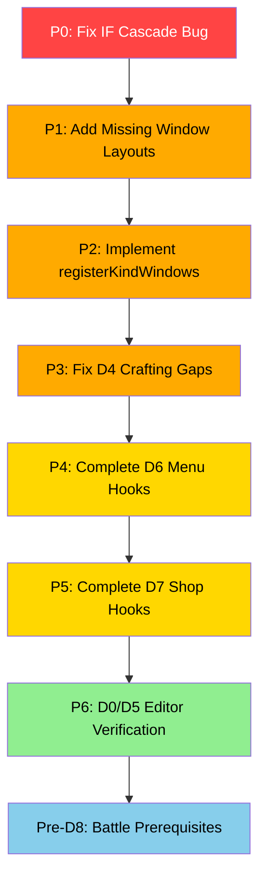
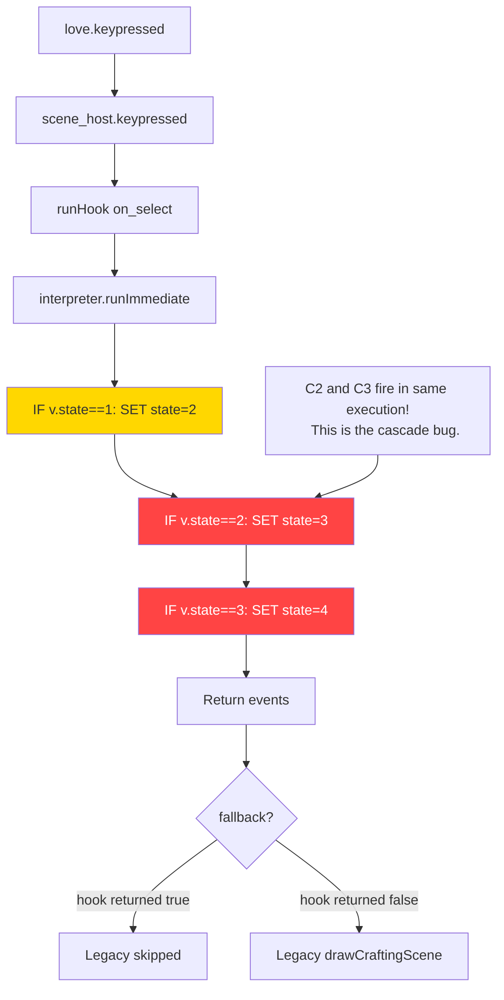

# Overhaul 4 — Project State Assessment

**Date:** 2026-07-09
**Scope:** D0–D7 task success evaluation; D8 intentionally postponed.

---

## Executive Summary

The D-task pipeline is **functional but incomplete**. The foundational infrastructure (D1–D3) is solid. The conversions (D4, D6, D7) have data hooks in [`data/scenes.json`](data/scenes.json:77) but suffer from a critical **cascading IF bug** in the `on_select` hook pattern, plus scattered integration gaps. The crafting scene specifically skips actor selection because sequential `IF` blocks fire all matching conditions on a single keypress rather than acting as an `if/elseif` chain.

---

## Per-Task Assessment

### D0 — Editor Polish: ⚠️ Unknown / Partially Complete

| Criterion | Status | Evidence |
|---|---|---|
| TELEPORT command replaces Descend Stairs | ✅ Done | [`data/engine.json:372`](data/engine.json:372) — `TELEPORT` command registered |
| Vertical labels in all tabs | ❓ Unknown | Requires editor HTML/JS review |
| Icons as top-leftmost element | ❓ Unknown | Requires editor HTML/JS review |
| Image preview as editable element | ❓ Unknown | Requires editor HTML/JS review |
| Selector preview (animated) | ❓ Unknown | Requires editor HTML/JS review |

**Verdict:** The TELEPORT rename is the only verifiable change from static analysis. The remaining four criteria need editor code review. The [`FEEDBACK.md`](docs/plans/overhaul-4/FEEDBACK.md:30) items #2–#5 map to these same concerns, suggesting they may not be fully resolved.

---

### D1 — Scene Host & Hooks: ✅ Complete

| Criterion | Status | Evidence |
|---|---|---|
| Scene host with frame loop, rendering, cursor | ✅ Done | [`engine/scene_host.lua`](engine/scene_host.lua:1) — full implementation |
| scenes.json gains `hooks` (on_enter, on_select, on_cancel, on_frame, on_exit) | ✅ Done | [`data/scenes.json:77`](data/scenes.json:77) — crafting, title, menu, items, status, shop all have hooks |
| Immediate-mode execution via `interpreter.runImmediate` | ✅ Done | [`engine/scene_host.lua:89`](engine/scene_host.lua:89) |
| Scene-local `v` scoped per instance | ✅ Done | [`engine/scene_host.lua:65`](engine/scene_host.lua:65) — `ctx.v = state.v` |
| Fallback rule (absent hook → legacy Lua) | ✅ Done | [`engine/scene_host.lua:59-61`](engine/scene_host.lua:59) — returns false |
| WAIT timer handling | ✅ Done | [`engine/scene_host.lua:151-153`](engine/scene_host.lua:151) |
| WASD → arrow key normalization | ✅ Done | [`engine/scene_host.lua:168-172`](engine/scene_host.lua:168) |
| `on_up/on_down/on_left/on_right` dispatch | ✅ Done | [`engine/scene_host.lua:178-185`](engine/scene_host.lua:178) |

**Verdict:** The scene host is the strongest piece of this overhaul. All SPEC S2 requirements are met, with hooks dispatching correctly and the fallback rule working as designed.

---

### D2 — UI Command Vocabulary: ⚠️ Partial

| Criterion | Status | Evidence |
|---|---|---|
| Register scene commands (OPEN_WINDOW, CLOSE_WINDOW, etc.) | ✅ Done | [`data/engine.json:987-1126`](data/engine.json:987) — all 10 commands registered |
| WAIT as non-blocking host-timed suspension | ✅ Done | [`engine/scene_host.lua:95-96`](engine/scene_host.lua:95) — wait events consumed by update |
| Window geometry in `engine.json → windowLayout` | ❌ **Empty** | [`data/engine.json:1409`](data/engine.json:1409) — only `headerSpacing: 0` exists |
| Remove black border around headers | ❓ Unknown | Needs runtime verification |
| Global header-content spacing config | ❓ Unknown | The `headerSpacing` key exists but may not be consumed |
| Global right-alignment (ui.tileSize from right) | ❓ Unknown | Needs runtime verification |

**Verdict:** Commands are registered and handlers exist, but the critical `windowLayout` data is empty. Without window geometry definitions, the D2 vocabulary is incomplete — no scene can declare where its windows render. The UI feedback items (border, spacing, alignment) have partial config entries but no confirmed consumption.

---

### D3 — UI-Golden Harness: ✅ Complete

| Criterion | Status | Evidence |
|---|---|---|
| `love . validate golden-ui` support | ✅ Done | [`main.lua:127-232`](main.lua:127) — full golden harness |
| Scripted input sequence driving | ✅ Done | [`main.lua:150-167`](main.lua:150) — sceneScripts for crafting and shop |
| Normalized UI event log (`window|action|target|value`) | ✅ Done | [`main.lua:180-194`](main.lua:180) — logEvents function |
| Reference log at `tools/golden/scene_crafting.log` | ✅ Done | [`tools/golden/scene_crafting.log`](tools/golden/scene_crafting.log:1) — 418 lines |
| Validator enforces scene hook rules | ✅ Done | [`main.lua:908-911`](main.lua:908) — crafting-specific validation in golden path |

**Verdict:** The golden harness is complete and functional. The `scene_crafting.log` captures window events, though the log content itself reveals the cascade bug (see D4 below).

---

### D4 — Convert Crafting to Hooks: ❌ **Buggy** (Critical Issues)

| Criterion | Status | Evidence |
|---|---|---|
| Hooks replace legacy UI logic | ⚠️ Partial | Hooks exist but have cascade bug |
| on_enter: OPEN_WINDOW discipline list, SET_LIST | ✅ Done | [`data/scenes.json:78-95`](data/scenes.json:78) |
| on_select: IF drilldown (discipline→crafter→ingredients→yield→pool) | ❌ **Cascade bug** | Sequential IF blocks fire all at once |
| on_cancel: step back or SCENE_EVENT pop | ⚠️ Partial | Same cascade issue affects cancel |
| Roulette via on_frame + CALC_CRAFT_YIELD | ✅ Done | [`data/scenes.json:230-234`](data/scenes.json:230) |
| **Fix 2x portrait scale** | ❌ **Not fixed** | [`engine/scenes/crafting.lua:336`](engine/scenes/crafting.lua:336) still uses `2, 2` |
| UI-golden byte-identical | ❌ **Log reflects cascade** | The golden log shows rapid state cycling |

#### 🔴 Root Cause: Sequential IF Cascade

The `on_select` hooks in [`data/scenes.json:96-151`](data/scenes.json:96) are structured as sequential `IF` blocks:

```json
"on_select": [
  { "cmd": "IF", "condition": "v.state == 1", "then": [
    { "cmd": "SET_VAR", "name": "state", "value": 2 },  // sets state to 2
    ...
  ]},
  { "cmd": "IF", "condition": "v.state == 2", "then": [  // IMMEDIATELY matches!
    { "cmd": "SET_VAR", "name": "state", "value": 3 },  // sets state to 3
    ...
  ]},
  { "cmd": "IF", "condition": "v.state == 3", "then": [  // ALSO matches!
    ...
  ]},
  ...
]
```

When `v.state == 1` and RETURN is pressed, `interpreter.runImmediate` executes ALL commands in the `on_select` list sequentially:
1. First IF: `v.state == 1` → true → sets `v.state = 2`
2. Second IF: `v.state == 2` → now true → sets `v.state = 3`
3. Third IF: `v.state == 3` → now true → sets `v.state = 4` (if ingredients available)

**This causes a single RETURN press to cascade from state 1 through state 3 (or 4), skipping the actor selection screen entirely.** The same cascade affects `on_cancel` hooks.

The golden log at [`tools/golden/scene_crafting.log`](tools/golden/scene_crafting.log:1) confirms this: it shows `discipline_panel|close → crafter_panel|open → crafter_panel|close → ingredient_panel|open` in rapid succession — the crafter panel flashes open and immediately closes because state 2 transitions to state 3 in the same hook execution.

#### Additional D4 Gaps

1. **`registerKindWindows` missing:** [`engine/scene_host.lua:123-127`](engine/scene_host.lua:123) calls `crafting.registerKindWindows(scene_host)` but this function does not exist in [`engine/scenes/crafting.lua`](engine/scenes/crafting.lua:1). The call silently fails.

2. **No window layouts:** [`data/engine.json:1409`](data/engine.json:1409) `windowLayout` has only `headerSpacing: 0`. The D4 spec called for entries like `discipline_list`, `crafter_list`, `ingredient_slots`, `inventory_list`, `detail_panel`, `confirm_panel`, `roulette_window`, `result_window`, `yield_text`, `portrait`.

3. **Portrait still at 2x scale:** [`engine/scenes/crafting.lua:336`](engine/scenes/crafting.lua:336) `love.graphics.draw(img, ui.toPx(13), ui.toPx(5.5), 0, 2, 2)` — the D4 brief explicitly required fixing this to 1x.

4. **Party size hardcoded:** [`data/scenes.json:183,198`](data/scenes.json:183) uses `% 4` for crafter list wrapping. If the party has fewer than 4 members, this produces invalid indices.

5. **No left/right in golden script:** [`main.lua:151-161`](main.lua:151) the crafting test script never presses left/right to switch `cursorSlot` between ingredient slots 1 and 2. Both RETURN presses at state 3 select ingredient 1, then ingredient 1 again (both slots get the same item because `selectedIngredient2Idx` defaults to 1).

---

### D5 — Editor Unify: ❓ Unknown

| Criterion | Status | Evidence |
|---|---|---|
| Collapse Custom Scenes + Phase Flows into one tab | ❓ Unknown | Requires editor HTML/JS review |
| Hooks as phases, editable via renderCommandList | ❓ Unknown | Requires editor HTML/JS review |
| Command palette filtered to `contexts: ["scene"]` | ❓ Unknown | Requires editor HTML/JS review |
| Scene config as small property panel | ❓ Unknown | Requires editor HTML/JS review |
| `{ } JSON` toggle per hook | ❓ Unknown | Requires editor HTML/JS review |

**Verdict:** Cannot assess from engine-side code alone. The editor files (`tools/editor/index.html`, `tools/editor/js/*.js`) need direct inspection.

---

### D6 — Convert Menus (Title, Main Menu, Item, Status): ⚠️ Partially Decorated

| Criterion | Status | Evidence |
|---|---|---|
| Title scene with hooks | ⚠️ Minimal | [`data/scenes.json:237-251`](data/scenes.json:237) — on_enter only, no on_select |
| Main Menu scene with hooks | ⚠️ Minimal | [`data/scenes.json:252-271`](data/scenes.json:252) — on_enter + on_cancel, no on_select for menu options |
| Items scene with hooks | ⚠️ Minimal | [`data/scenes.json:272-288`](data/scenes.json:272) — on_enter + on_cancel, no navigation |
| Status scene with hooks | ⚠️ Minimal | [`data/scenes.json:289-302`](data/scenes.json:289) — on_enter + on_cancel, no navigation |
| Item list spacing fix | ❓ Unknown | Needs runtime verification |
| Inventory uses full window height | ❓ Unknown | Needs runtime verification |
| Equip scene item icons | ❓ Unknown | Needs runtime verification |
| Levels/Experience displayed | ❓ Unknown | Needs runtime verification |

**Verdict:** The menu scenes have **decorative hooks only** — `on_enter` opens windows and `on_cancel` pops the scene, but all actual menu logic (option navigation, sub-scene selection, party grid interaction) still runs through [`main.lua:1840-1889`](main.lua:1840) as legacy code. The hooks don't drive behavior; they co-exist alongside legacy code. This is the correct *first step* per the fallback rule, but the conversion is not complete.

---

### D7 — Convert Shop: ⚠️ Partial

| Criterion | Status | Evidence |
|---|---|---|
| Shop hooks in scenes.json | ✅ Done | [`data/scenes.json:303-343`](data/scenes.json:303) — on_enter, on_up, on_down, on_cancel, on_select |
| Conditional gold checks via IF/formulas | ⚠️ Partial | [`data/scenes.json:335`](data/scenes.json:335) — condition checks `session.gold >= v.items[v.idx].cost` |
| Pending item grant in main.lua | ⚠️ Still legacy | [`main.lua:1093-1099`](main.lua:1093) — shop-specific logic runs outside hooks |
| Rendering still legacy | ✅ Expected | [`main.lua:1122-1124`](main.lua:1122) — `renderer.drawShop()` called directly |

**Verdict:** Shop has the most complete hooks of any D6/D7 scene (including on_up/on_down and on_select with conditions), but the item grant is still handled in `main.lua` update rather than within the hook flow.

---

### D8 — Battle as Scene: 🚫 Postponed (Intentionally)

Per [`docs/plans/overhaul-4/pre-d8-plan.md`](docs/plans/overhaul-4/pre-d8-plan.md:1), D8 has 4 prerequisite sub-tasks (D09–D12) that have not been started. The pre-D8 analysis is complete and documents the ~1,170 lines of battle code across 3 files.

---

## Cross-Cutting Issues

### 1. 🔴 Sequential IF Cascade (D4, D6, D7)

Every scene that uses multiple `IF` blocks in `on_select` or `on_cancel` is vulnerable to the cascade bug. The `interpreter.runImmediate` function executes all commands in a hook list sequentially — there is no `elseif` semantics. When one IF block modifies `v.state`, subsequent IF blocks in the same hook list see the new value.

**Affected hooks:**
- [`data/scenes.json:96-151`](data/scenes.json:96) — crafting `on_select` (5 sequential IFs)
- [`data/scenes.json:152-177`](data/scenes.json:152) — crafting `on_cancel` (5 sequential IFs)
- [`data/scenes.json:178-194`](data/scenes.json:178) — crafting `on_up` (3 sequential IFs)
- [`data/scenes.json:196-212`](data/scenes.json:196) — crafting `on_down` (3 sequential IFs)
- [`data/scenes.json:214-228`](data/scenes.json:214) — crafting `on_left/on_right` (2 sequential IFs each)

### 2. 🟡 Missing Window Layout Data (D2)

[`data/engine.json:1409`](data/engine.json:1409) `windowLayout` is effectively empty. Without window geometry, the D2 vocabulary commands (`OPEN_WINDOW`, `SET_LIST`, etc.) can emit events but have no layout semantics. The golden test captures events but actual rendering still relies on hardcoded coordinates in `drawCraftingScene` and `renderer.drawShop`/`drawMainMenu`.

### 3. 🟡 `registerKindWindows` Stub

[`engine/scene_host.lua:123-127`](engine/scene_host.lua:123) calls a function that doesn't exist. This is a silent no-op that prevents window registration for the crafting kind.

### 4. 🟡 Dual Rendering Path

All scenes still use legacy drawing:
- [`main.lua:1141-1142`](main.lua:1141) — `drawCraftingScene()`
- [`main.lua:1122-1124`](main.lua:1122) — `renderer.drawShop()`
- [`main.lua:1126-1140`](main.lua:1126) — `renderer.drawMainMenu()` etc.

The hooks manage state transitions, but rendering reads state independently. This is intentional per the SPEC fallback rule but means hooks and rendering can de-sync.

---

## Remediation Priority



### P0: Fix Sequential IF Cascade (Critical)

**Root cause:** [`engine/interpreter.lua`](engine/interpreter.lua:1) `runImmediate` executes all commands in a hook list sequentially without `elseif` semantics. When the first `IF` changes `v.state`, subsequent `IF` blocks see the mutated value.

**Fix options:**
1. **Hook-level guard variable:** Add a `v.handled` flag. Each IF block checks `not v.handled` AND its condition, then sets `v.handled = true`. Reset `v.handled` per hook invocation.
2. **Nested IF/ELSE pattern:** Restructure hooks so only the first IF has the real condition; subsequent IFs are nested in `else` branches.
3. **Interpreter-level change:** Add native `ELSE_IF` support to prevent cascade. (Heavier change, affects validator too.)

**Recommended:** Option 1 (guard variable) is the lightest touch. Option 2 is more idiomatic JSON. Option 3 is the most correct long-term fix.

### P1: Add Missing Window Layouts

Add window geometry entries to [`data/engine.json:1409`](data/engine.json:1409) `windowLayout` for all scenes:
- Crafting: `discipline_list`, `crafter_list`, `ingredient_slots`, `inventory_list`, `detail_panel`, `confirm_panel`, `roulette_window`, `result_window`
- Title: `title_frame`, `title_menu`
- Menu: `menu_left_panel`, `menu_right_panel`, `menu_info_panel`
- Items: `items_left_panel`, `items_info_panel`
- Status: `status_panel`
- Shop: Shop windows

### P2: Implement `registerKindWindows`

Add `crafting.registerKindWindows(host)` to [`engine/scenes/crafting.lua`](engine/scenes/crafting.lua:1) that registers window definitions. Currently a silent no-op.

### P3: Fix D4 Crafting Gaps

1. Fix portrait scale from 2x → 1x at [`engine/scenes/crafting.lua:336`](engine/scenes/crafting.lua:336)
2. Dynamic party size in [`data/scenes.json:183,198`](data/scenes.json:183) instead of hardcoded `% 4`
3. Add left/right steps to the golden test script at [`main.lua:151-161`](main.lua:151)
4. Regenerate golden log after fixing cascade bug

### P4: Complete D6 Menu Hooks

Add actual behavior to menu scene hooks (on_select for navigating options, on_up/on_down for cursor movement). Currently menus only have decorative on_enter hooks.

### P5: Complete D7 Shop Hooks

Move the `pendingItem` grant logic from [`main.lua:1093-1099`](main.lua:1093) into the shop hooks flow so the shop is self-contained.

### P6: D0/D5 Editor Verification

Audit [`tools/editor/`](tools/editor/index.html) files to verify D0 and D5 criteria. This requires editor HTML/JS review.

---

## Architecture Diagram: Current Hook Execution Flow



---

## Files Requiring Changes (Summary)

| File | Issues |
|---|---|
| [`data/scenes.json`](data/scenes.json:77) | IF cascade in all crafting hooks; incomplete D6/D7 hooks |
| [`engine/scenes/crafting.lua`](engine/scenes/crafting.lua:1) | Missing `registerKindWindows`; 2x portrait scale; no window defs |
| [`data/engine.json`](data/engine.json:1409) | Empty `windowLayout` |
| [`main.lua`](main.lua:1) | Shop pendingItem logic outside hooks; golden test script needs left/right |
| [`engine/interpreter.lua`](engine/interpreter.lua:1) | No `elseif` semantics (optional fix) |
| [`tools/editor/`](tools/editor/index.html) | D0/D5 criteria need verification |
