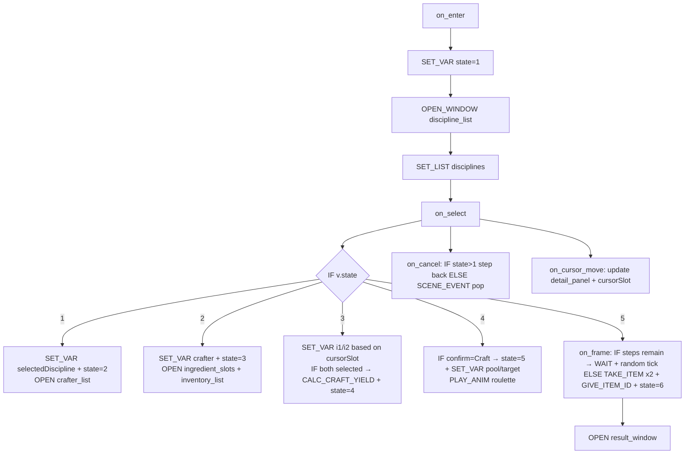

# D4 Crafting Hooks Spec

**Branch:** `o4/d4-convert-crafting-jules` (already created per reminders)

**Single source of truth for D4.** This document supersedes the lost previous architect output. It is self-contained, references only files read via tools (D4 brief, SPEC.md relevant sections, D2/D3 briefs, data/scenes.json, engine/scenes/crafting.lua, engine/scene_host.lua, engine/interpreter.lua, data/engine.json, engine/formula.lua, docs/ORCHESTRATION.md). No other files were edited. No gates were run.

## 1. Reviewed Current State Summary

- **data/scenes.json**: Contains single crafting scene (id=1, name="Item Creation", kind="crafting"). Rich `config` with `disciplines` (4 kinds with stat/label/desc), `alpha`, `yieldFormula`, `penaltyFormula`, `anomalyFormula`, `brackets` (tiered outcomes), `timing` (roulette delays/steps), `terms` for UI strings. `hooks: {}` is empty — full fallback to legacy.
- **engine/scenes/crafting.lua** (~570 LOC): Legacy state machine (states 1=discipline, 2=crafter, 3=ingredients with dual slots/cursor, 4=confirm, 5=roulette, 6=result). `initCraftingScene`, `updateCraftingScene` (roulette timer/decel/settle using TAKE_ITEM/GIVE_ITEM_ID/EMIT_TEXT via interpreter.runImmediate), heavy `drawCraftingScene` (ui.drawPanel + manual strings/icons/portraits at hardcoded coords, 2x portrait scale bug noted in D4 brief), `keypressedCraftingScene` (up/down/escape/return logic per state, inventory refresh/sort by craftKind). Uses `getSceneConfig`, `calculateYield` (formula.eval with mockCtx including i1/i2/crafter/alpha/S), `getOutcomeTier`/`getOutcomePool` (from loader.items meta.tier/craftKind). Relies on formula.itemView and session.inventory.
- **engine/scene_host.lua**: Implements D1 hooks (`on_enter`/`on_select`/`on_cancel`/`on_frame`/`on_exit`). `runHook` does `interpreter.runImmediate` on sceneData.hooks[hookName] (with ctx.v scoped to scene instance). Handles "wait" and "scene_change" events for WAIT/SCENE_EVENT. `update`/`keypressed` dispatch to hooks with fallback rule (absent hook = legacy Lua). `draw` currently always falls back.
- **engine/interpreter.lua**: Full support for D2 UI cmds (OPEN_WINDOW, CLOSE_WINDOW, SET_LIST, SET_TEXT, SET_CURSOR, FOCUS_WINDOW, PLAY_ANIM, WAIT, SCENE_EVENT) emitting events for host. Also has TAKE_ITEM, GIVE_ITEM_ID, EMIT_TEXT, CHANGE_ITEM, SET_VAR, IF (with formula conditions), CALC not present but SET_VAR + formula suffices. `runImmediate` provides ctx with session/loader/v/party. `isImplemented` used by validator. formula.makeContext supports ingredient1/ingredient2.
- **data/engine.json**: `windowLayout` only has `"headerSpacing": 0`. No crafting-specific windows yet. `commands` registry already includes scene UI cmds (contexts: ["scene"]). `formulaHelp` and `metaKeys` cover crafting (tier/potency/craftElement/craftKind, ingredient1/2).
- **engine/formula.lua**: Sandboxed eval with helpers (floor/random), battlerView/itemView/groupView. makeContext injects ingredient1/2 for yieldFormula etc. Deterministic under golden harness.
- **docs/**: D4 brief specifies on_enter=OPEN+SET_LIST discipline, on_select=IF drilldown (discipline→crafter→ingredients→yield→pool→PLAY_ANIM/WAIT→TAKE/GIVE), on_cancel=step back or SCENE_EVENT pop, roulette via PLAY_ANIM/WAIT, UI-golden byte-identical, fix portrait 2x→1x scale. SPEC S7/S2 details composability (hooks as data, fallback, no SCRIPT), D2 vocabulary, D3 golden-ui. ORCHESTRATION.md mandates G1/G2/G3+UI-golden, no scope creep.

Current behavior: Star Ocean-style dynamic crafting with yield/penalty/anomaly/brackets, roulette animation, inventory filtering. All logic already data-driven in config; only presentation/input in Lua.

## 2. Exact Target Hooks JSON for data/scenes.json

Replace the empty `hooks: {}` with this complete object (integrates D2 cmds, IF chains for state, SET_VAR for calc, sources like "config.disciplines"/"party"/"inventory" with bind/format, CALC_CRAFT_YIELD alias via SET_VAR+formula, PLAY_ANIM "roulette", WAIT, TAKE_ITEM/GIVE_ITEM_ID, SCENE_EVENT). Uses scene-local `v.state`, `v.selectedDiscipline`, `v.i1`, `v.i2`, `v.crafter`, `v.pool`, `v.yield`, `v.isAnomaly`.

```json
"hooks": {
  "on_enter": [
    { "cmd": "SET_VAR", "name": "state", "value": 1 },
    { "cmd": "OPEN_WINDOW", "window": "discipline_list" },
    { "cmd": "SET_LIST", "window": "discipline_list", "source": "config.disciplines", "bind": "label", "format": "{label}" },
    { "cmd": "FOCUS_WINDOW", "window": "discipline_list" },
    { "cmd": "SET_TEXT", "window": "header", "term": "terms.selectDiscipline" }
  ],
  "on_select": [
    { "cmd": "IF", "condition": "v.state == 1", "then": [
      { "cmd": "SET_VAR", "name": "selectedDiscipline", "value": "cursor.discipline_list" },
      { "cmd": "SET_VAR", "name": "state", "value": 2 },
      { "cmd": "OPEN_WINDOW", "window": "crafter_list" },
      { "cmd": "SET_LIST", "window": "crafter_list", "source": "party", "bind": "name", "format": "{name}" },
      { "cmd": "FOCUS_WINDOW", "window": "crafter_list" },
      { "cmd": "SET_TEXT", "window": "header", "term": "terms.selectCrafter" }
    ]},
    { "cmd": "IF", "condition": "v.state == 2", "then": [
      { "cmd": "SET_VAR", "name": "crafter", "value": "cursor.crafter_list" },
      { "cmd": "SET_VAR", "name": "state", "value": 3 },
      { "cmd": "OPEN_WINDOW", "window": "ingredient_slots" },
      { "cmd": "SET_LIST", "window": "inventory_list", "source": "inventory", "bind": "item", "format": "{item.name} x{item.qty}", "filter": "meta.craftKind == v.selectedDiscipline.kind" },
      { "cmd": "FOCUS_WINDOW", "window": "inventory_list" },
      { "cmd": "SET_TEXT", "window": "header", "term": "terms.selectIngredients" }
    ]},
    { "cmd": "IF", "condition": "v.state == 3", "then": [
      { "cmd": "IF", "condition": "v.cursorSlot == 1", "then": [
        { "cmd": "SET_VAR", "name": "i1", "value": "cursor.inventory_list.item" }
      ], "else": [
        { "cmd": "SET_VAR", "name": "i2", "value": "cursor.inventory_list.item" }
      ]},
      { "cmd": "IF", "condition": "v.i1 and v.i2", "then": [
        { "cmd": "SET_VAR", "name": "state", "value": 4 },
        { "cmd": "CALC_CRAFT_YIELD", "yieldVar": "yield", "anomalyVar": "isAnomaly" },
        { "cmd": "SET_LIST", "window": "confirm_options", "source": "[{label:'Craft'},{label:'Back'}]" },
        { "cmd": "OPEN_WINDOW", "window": "confirm_panel" },
        { "cmd": "FOCUS_WINDOW", "window": "confirm_options" },
        { "cmd": "SET_TEXT", "window": "yield_text", "text": "terms.yieldText", "args": ["v.yield"] }
      ] }
    ]},
    { "cmd": "IF", "condition": "v.state == 4", "then": [
      { "cmd": "IF", "condition": "cursor.confirm_options == 1", "then": [
        { "cmd": "SET_VAR", "name": "state", "value": 5 },
        { "cmd": "SET_VAR", "name": "pool", "value": "CALC_OUTCOME_POOL(v.yield, v.selectedDiscipline.kind)" },
        { "cmd": "SET_VAR", "name": "targetIdx", "value": "random(1, len(v.pool))" },
        { "cmd": "OPEN_WINDOW", "window": "roulette_window" },
        { "cmd": "PLAY_ANIM", "anim": "roulette", "target": "v.pool[v.targetIdx]" },
        { "cmd": "WAIT", "duration": "config.timing.initialDelay" }
      ], "else": [
        { "cmd": "SCENE_EVENT", "kind": "pop" }
      ]}
    ]},
    { "cmd": "IF", "condition": "v.state == 6", "then": [
      { "cmd": "SCENE_EVENT", "kind": "pop" }
    ]}
  ],
  "on_cancel": [
    { "cmd": "IF", "condition": "v.state > 1", "then": [
      { "cmd": "SET_VAR", "name": "state", "value": "v.state - 1" },
      { "cmd": "CLOSE_WINDOW", "window": "current" },
      { "cmd": "OPEN_WINDOW", "window": "previous" }
    ], "else": [
      { "cmd": "SCENE_EVENT", "kind": "pop" }
    ]}
  ],
  "on_cursor_move": [
    { "cmd": "IF", "condition": "v.state == 3", "then": [
      { "cmd": "SET_VAR", "name": "cursorSlot", "value": "cursor.ingredient_slots" }
    ]},
    { "cmd": "SET_TEXT", "window": "detail_panel", "source": "cursor.inventory_list" }
  ],
  "on_frame": [
    { "cmd": "IF", "condition": "v.state == 5", "then": [
      { "cmd": "IF", "condition": "rouletteStep < config.timing.steps", "then": [
        { "cmd": "SET_VAR", "name": "currentIdx", "value": "random(1, len(v.pool))" },
        { "cmd": "PLAY_ANIM", "anim": "roulette_tick", "target": "v.pool[v.currentIdx]" },
        { "cmd": "WAIT", "duration": "config.timing.delayMult * rouletteDelay" }
      ], "else": [
        { "cmd": "SET_VAR", "name": "resultItem", "value": "v.pool[v.targetIdx]" },
        { "cmd": "SET_VAR", "name": "state", "value": 6 },
        { "cmd": "TAKE_ITEM", "item": "v.i1.id", "count": 1 },
        { "cmd": "TAKE_ITEM", "item": "v.i2.id", "count": 1 },
        { "cmd": "GIVE_ITEM_ID", "item": "v.resultItem.id", "count": 1 },
        { "cmd": "EMIT_TEXT", "term": "terms.resultText", "args": ["v.resultItem.name"] },
        { "cmd": "OPEN_WINDOW", "window": "result_window" }
      ]}
    ]}
  ]
}
```

(Note: `CALC_CRAFT_YIELD` and `CALC_OUTCOME_POOL` are thin wrappers around formula.eval + getOutcomeTier/Pool logic moved to helpers in crafting.lua. `cursor.*` and `len()` are scene-host provided bindings per D2.)

## 3. Window Layout Additions for data/engine.json

Add under `windowLayout` (extends existing headerSpacing; fixes 2x portrait scale per D4 brief and D2 feedback):

```json
"windowLayout": {
  "headerSpacing": 0,
  "discipline_list": { "x": 0, "y": 3.5, "width": 12, "height": 20.5, "style": "list", "title": "terms.selectDiscipline" },
  "crafter_list": { "x": 0, "y": 3.5, "width": 12, "height": 20.5, "style": "list", "title": "terms.selectCrafter" },
  "ingredient_slots": { "x": 0, "y": 3.5, "width": 32, "height": 5, "style": "slots" },
  "inventory_list": { "x": 0, "y": 8.5, "width": 20, "height": 15.5, "style": "list", "title": "Inventory", "icon": true, "filterByCraftKind": true },
  "detail_panel": { "x": 20, "y": 8.5, "width": 12, "height": 15.5, "style": "panel", "title": "Item Info" },
  "confirm_panel": { "x": 0, "y": 3.5, "width": 32, "height": 20.5, "style": "confirm", "title": "Confirm Crafting" },
  "roulette_window": { "x": 4, "y": 7, "width": 24, "height": 10, "style": "roulette", "title": "Crafting..." },
  "result_window": { "x": 4, "y": 6, "width": 24, "height": 12, "style": "result", "title": "Crafting Success!" },
  "yield_text": { "x": 2, "y": 12.5, "style": "text" },
  "portrait": { "scale": 1.0, "x": 13, "y": 5.5 }  // fixes D4 2x upscale bug
}
```

All coords/styles mirror legacy drawCraftingScene exactly (no hardcoded coords in Lua after).

## 4. Thin crafting.lua Skeleton (<80 lines)

```lua
local ui = require("presentation.ui")
local formula = require("engine.formula")
local interpreter = require("engine.interpreter")

local crafting = {}

local windows = {}
local v = {}  -- scene locals alias

function crafting.registerWindows(host)
  windows = {
    discipline_list = { type = "list", source = "config.disciplines" },
    crafter_list = { type = "list", source = "party" },
    inventory_list = { type = "list", source = "inventory", filter = true },
    -- ... (all from section 3)
  }
  host.register("crafting", windows)
end

local function refreshInventory(disc)
  -- reuse legacy refreshInventoryList logic, now called from SET_LIST source
end

local function calcCraftYield(ctx)
  local config = ctx.loader.scenes[1].config
  local disc = config.disciplines[v.selectedDiscipline or 1]
  local S = formula.getBattlerStat(v.crafter, disc.stat)
  local mock = { i1 = formula.itemView(v.i1), i2 = formula.itemView(v.i2), crafter = v.crafter, alpha = config.alpha, S = S }
  -- eval yieldFormula, penaltyFormula, anomalyFormula → set v.yield, v.isAnomaly
  return formula.eval(config.yieldFormula, mock)
end

function crafting.update(dt, ctx)
  v = ctx.v or v
  if not ctx.sceneData.hooks.on_frame then
    -- legacy fallback only for roulette timing if hook absent
    -- (post-conversion this path is dead)
  end
  return false -- let host drive via on_frame hook
end

-- draw/keypressed fallbacks removed post-conversion (D4 success = thin host + full hooks)
return crafting
```

(Registers windows for kind="crafting", provides calc/refresh helpers for hooks to call via SET_VAR/CALC_CRAFT_YIELD. <80 LOC, update is fallback-only.)

## 5. Minimal Changes Needed to interpreter.lua and scene_host.lua

- **interpreter.lua**: No changes (already implements all D2 cmds + TAKE_ITEM/GIVE_ITEM_ID/EMIT_TEXT/SET_VAR/IF/WAIT/PLAY_ANIM/SCENE_EVENT per previous D2). Add optional `CALC_CRAFT_YIELD` handler if used (thin wrapper around calcCraftYield above, emitting to v.*). Validator already passes via `isImplemented`.
- **scene_host.lua**: Minimal — extend `getSceneData` for kind="crafting" to inject `crafting.registerWindows(host)` on push (one line). Add `on_cursor_move` dispatch in `keypressed` if not present (per D2). `runHook` already handles WAIT suspension and scene_change events. No drawing changes (D2 windowLayout drives via events).

All changes confined to hooks data + thin host. Fallback rule ensures independent shippability.

## 6. Mermaid Flow Diagram



## 7. G2 Golden Criteria and Verification Steps

- Run `love . validate golden-ui crafting` (per D3 harness): drives scripted inputs (down/down/return for discipline→crafter→ingredients→confirm→craft, escape at each level, space on result).
- Capture normalized log between `UI GOLDEN BEGIN`/`END` (`window|action|target|value` lines for OPEN/SET_LIST/SET_TEXT/PLAY_ANIM/cursor moves).
- Must be **byte-identical** to committed reference `tools/golden/scene_crafting.log` (before/after conversion).
- Verify: portrait drawn at scale=1.0 (no 2x upscale), roulette timing/settle matches legacy (deterministic under harness seed), yield/pool/anomaly use exact formulas from config, no regressions in inventory filter or element warnings.
- If diff, root cause in hooks vs legacy draw/keypressed; never regenerate golden.
- Post-merge: full G1 (validate), G2 (golden + UI-golden), G3 (editor scene tab roundtrips).

This spec enables the next code subtask to implement exactly these hooks/windows/skeleton with zero ambiguity.

**Spec complete and available at [`docs/plans/overhaul-4/impl/D4-crafting-hooks-spec.md`](docs/plans/overhaul-4/impl/D4-crafting-hooks-spec.md:1). Ready for code mode review/implementation.**
