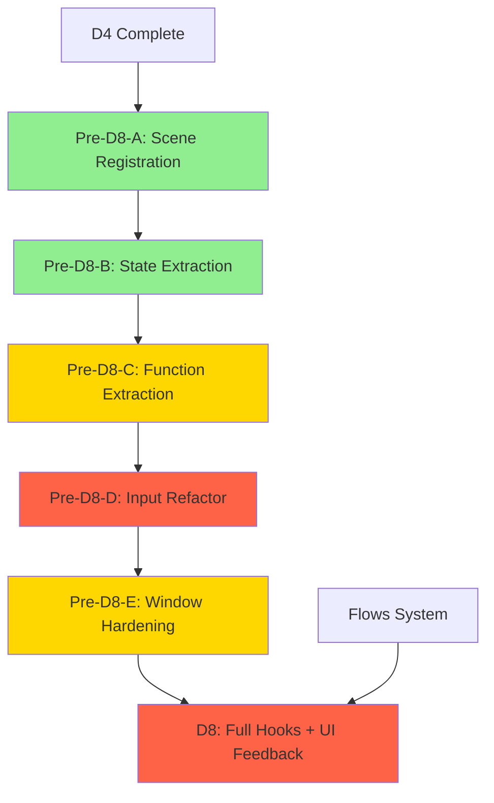

# Pre-D8: Battle Scene Refactoring Prerequisites

**Status:** 📋 Analysis complete — tasks not started
**Dependencies:** D4 (crafting hooks) completed and G1-validated
**Target:** Clean battle architecture before D8 hooks conversion + 9 UI feedback items

---

## Current State: Battle Entanglement Map

### Where battle code lives today

| Location | Lines | What It Does |
|---|---|---|
| [`main.lua:77-86`](main.lua:77) | 10 | Battle globals: `activeBattle`, `battleCombatLog`, `battleCombatState`, `battleSelectedIndex`, `battleSpellSelect`, `battleEventsQueue`, `battleEventQueueIndex`, `battleEscaped` |
| [`main.lua:105-108`](main.lua:105) | 4 | Interactive input globals: `battleLivingMembers`, `battleActiveMemberIndex`, `battleCollectedActions` |
| [`main.lua:1397-1408`](main.lua:1397) | 12 | `rebuildBattleLivingMembers()` — rebuilds the active turn order |
| [`main.lua:1410-1463`](main.lua:1410) | 54 | `triggerBattle()` — enemy composition, battle construction, state init |
| [`main.lua:1465-1496`](main.lua:1465) | 32 | `triggerTestBattle()` — test mode battle setup |
| [`main.lua:1501-1503`](main.lua:1501) | 3 | `getTargetCoords()` — battler → screen position mapping |
| [`main.lua:1506-1530`](main.lua:1506) | 25 | `resolveBattleRound()` — round resolution with state backup/restore for sequential rendering |
| [`main.lua:1533-1617`](main.lua:1533) | 85 | `advanceBattleLog()` — sequential log advancement with popup spawning and HP animation |
| [`main.lua:1620-1634`](main.lua:1620) | 15 | `commitBattleAction()` — action collection, round trigger |
| [`main.lua:1637-1643`](main.lua:1637) | 7 | `showBattleMessage()` — one-line message display |
| [`main.lua:2073-2276`](main.lua:2073) | 204 | `handleKeyPressed` battle section — input handling for input/log states + victory/defeat/escape transitions |
| [`main.lua:1119-1120`](main.lua:1119) | 2 | `love.draw` → `renderer.drawBattle(...)` with 7 parameters |
| [`engine/battle.lua`](engine/battle.lua:1) | 403 | Battle class, `resolveRound`, AI, victory/defeat checking |
| [`presentation/renderer.lua:570-750`](presentation/renderer.lua:570) | 180 | `drawBattle` — enemy sprites, combat log, command console, party grid, damage popups |

**Total: ~590 lines in main.lua, 403 in battle.lua, 180 in renderer.lua = ~1,170 lines of battle code**

### How battle connects to flows.json

The battle engine already uses the flows system correctly:

| Phase | Used In | Flow Has/Returns |
|---|---|---|
| `battle.battle_start` | [`triggerBattle()`](main.lua:1416) | SPAWN_ENEMIES → enemy list |
| `battle.flee_attempt` | [`Battle.resolveRound`](engine/battle.lua:117) | EMIT_EVENT flee_success or fail |
| `battle.round_end` | [`Battle.resolveRound`](engine/battle.lua:262) | STATE_TICKS, MP drain |
| `battle.victory` | [`handleKeyPressed`](main.lua:2212) | GAIN_GOLD, GRANT_XP, TRAIT_HEAL |
| `battle.defeat` | [`handleKeyPressed`](main.lua:2240) | SCENE_EVENT defeat |
| `battle.escaped` | [`handleKeyPressed`](main.lua:2258) | SCENE_EVENT map |
| `battle.encounter_check` | [`handleKeyPressed`](main.lua:1796) | ROLL_ENCOUNTER → encounter event |

**The flows system itself needs NO changes — it's fully functional.**

### How battle is NOT yet a scene

- Battle has **no entry** in [`data/scenes.json`](data/scenes.json:1)
- `scene_host.goto_scene("battle")` resolves `"battle"` via `getSceneData` matching by kind/name/id — but there's no scene entry for it, so `getSceneData` returns nil, and `runHook` always returns `false`
- All battle drawing goes through [`renderer.drawBattle`](presentation/renderer.lua:570) called directly from [`love.draw`](main.lua:1119)
- All input goes through main.lua's `handleKeyPressed` directly

---

## What D8 Requires

From [`docs/plans/overhaul-4/briefs/D8-battle-scene.md`](docs/plans/overhaul-4/briefs/D8-battle-scene.md:1):

1. Convert battle scene loops into data hooks in `scenes.json`
2. **9 UI feedback items:**
   - B.5: Small sprite system (animated, width/height cell count, default 24x24)
   - B.2: Enemy sprite rendering via sprite keys
   - B.4: Creature element icons displaced 3px X/Y
   - B.1: Summoner's HP in battle UI
   - B.6: Summoner status repositioned to top-left of front row
   - B.7: Battler commands menu as standalone window
   - B.8: Two-line battle log
   - B.0: Per-character text delay
   - B.9: Dedicated Victory window
3. Regenerate `tools/golden/battle.log` with line-by-line justification

From [`plans/d8-battle-scene-plan.md`](plans/d8-battle-scene-plan.md:1) the scaffolded plan has 5 phases:
- Phase 1: Small sprite system (prerequisite)
- Phase 2: Battle UI overhaul (6 visual fixes)
- Phase 3: Text character delay (independent)
- Phase 4: Convert battle to hooks
- Phase 5: Golden log verification

---

## Prerequisites: What Must Be Done Before D8

### Pre-D8-A: Battle Scene Registration

**Goal:** Make battle a first-class scene managed by `scene_host`, using the same pattern proven by D4.

Add a battle scene entry to [`data/scenes.json`](data/scenes.json:1):

```json
{
  "id": "battle",
  "name": "Battle",
  "kind": "battle",
  "hooks": {
    "on_enter": [
      { "cmd": "SET_VAR", "name": "combatState", "value": "input" },
      { "cmd": "SET_VAR", "name": "selectedIndex", "value": 1 },
      { "cmd": "SET_VAR", "name": "spellSelect", "value": 0 }
    ],
    "on_cancel": [],
    "on_frame": []
  }
}
```

**Files:** `data/scenes.json` only.

This forces `scene_host.runHook()` to be called for battle lifecycle events. Initially hooks will be minimal (on_enter sets initial state, on_frame is empty since legacy handles it). The legacy code continues to work through the fallback rule because hooks don't exist for `on_select`, `on_up`, `on_down`, etc. yet.

### Pre-D8-B: Extract Battle State from main.lua to Scene State

**Goal:** Move all battle globals from main.lua into `scene_host.getCurrentState().v`, following the exact same pattern used for crafting in D4.

Currently, main.lua has 12 battle-specific global variables:

```lua
-- In main.lua currently:
local activeBattle           -- → scene.v.battle
local battleCombatLog        -- → scene.v.combatLog
local battleCombatState      -- → scene.v.combatState
local battleSelectedIndex    -- → scene.v.selectedIndex
local battleSpellSelect      -- → scene.v.spellSelect (boolean)
local battleEventsQueue      -- → scene.v.eventsQueue
local battleEventQueueIndex  -- → scene.v.eventQueueIndex
local battleEscaped          -- → scene.v.escaped (boolean)
local battleLivingMembers    -- → scene.v.livingMembers
local battleActiveMemberIndex -- → scene.v.activeMemberIdx
local battleCollectedActions -- → scene.v.collectedActions
```

**Approach:** Add a helper function to scene_host or a dedicated module that resolves battle state:

```lua
-- engine/scenes/battle.lua (new file)
function battle.getState()
    local s = scene_host.getCurrentState()
    return s and s.v or {}
end
```

Then refactor main.lua's battle functions to read/write through `battle.getState()` instead of module-level locals.

**Files:** New `engine/scenes/battle.lua`, modifications to `main.lua`.

### Pre-D8-C: Extract Battle UI Functions from main.lua

**Goal:** Move the 7 battle-specific functions from main.lua into `engine/scenes/battle.lua`, following the D4 crafting pattern.

Functions to move:

| Function | From main.lua | Notes |
|---|---|---|
| `rebuildBattleLivingMembers` | Line 1397 | Depends on `activeSession`, `battleLivingMembers`, `battleCollectedActions` |
| `triggerBattle` | Line 1410 | Depends on `activeSession`, flows, `battleSystem` |
| `triggerTestBattle` | Line 1465 | Test mode only |
| `getTargetCoords` | Line 1501 | Depends on `renderer` |
| `resolveBattleRound` | Line 1506 | Depends on `activeBattle`, `activeSession` |
| `advanceBattleLog` | Line 1533 | Most complex — popups, HP animation, state mutations |
| `commitBattleAction` | Line 1620 | Depends on `battleCollectedActions`, `battleLivingMembers` |
| `showBattleMessage` | Line 1637 | Simple wrapper |

These become methods exported from `engine/scenes/battle.lua`. Main.lua retains thin glue that calls them.

**Files:** New functions in `engine/scenes/battle.lua`, main.lua calls pass-through wrappers.

### Pre-D8-D: Refactor Battle Input Handler

**Goal:** Move the ~200-line battle keypressed section from main.lua's `handleKeyPressed` into `engine/scenes/battle.lua`.

The battle input handler has two modes:

1. **"input" mode** (lines 2074-2204): Summoner commands (Attack/Spell/Item/Flee), Monster commands (Attack/Skill/Defend/Flee), spell/skill selection submenu
2. **"log" mode** (lines 2206-2275): Space to advance log, victory/defeat/escape transitions with flow checks

This is the most entangled section. The input handler references `activeSession`, `activeBattle`, all battle globals, `loader`, `conf()`, `battleSystem`, `scene_host`, `renderer`, and `traits`.

**Strategy:** Follow the same pattern as crafting — `scene_host.keypressed()` dispatches to hooks for `on_select`, `on_cancel`, `on_up`, `on_down`. For the interactive battle phase, the hooks would:
- Track `v.combatState` (input/log)
- Track `v.selectedIndex`, `v.spellSelect`
- `on_select` would call into battle.lua helper functions to commit actions
- `on_frame` would handle log advancement

This is the hardest part of the battle conversion and should come last.

**Files:** `engine/scenes/battle.lua`, `data/scenes.json`

### Pre-D8-E: Window System Hardening

**Goal:** Ensure the D2 window vocabulary (OPEN_WINDOW, CLOSE_WINDOW, SET_LIST, SET_TEXT, SET_CURSOR, FOCUS_WINDOW) can drive the battle UI.

**Current state:** These commands emit events but no actual rendering consumes them. For the crafting scene, we kept legacy drawing and used hooks only for logic. For battle, the same approach works initially.

**What's needed for battle-specific windows:**
- `battle_log_window`: Two-line combat log
- `battle_command_window`: Battler commands (flush with status)
- `battle_status_window`: Summoner HP/MP + creature grid
- `battle_victory_window`: Victory display

**However:** The D2 window system doesn't need to be fully built for D8 to start. Following the D4 pattern, hooks handle logic (state transitions, action collection) while legacy rendering handles visualization. The window commands in hooks emit events that the golden UI test captures, proving correctness.

**Minimal hardening for D8:**
1. Register battle window layout entries in `data/engine.json` → `windowLayout` (coordinate/position definitions)
2. Ensure `OPEN_WINDOW`/`CLOSE_WINDOW`/`SET_TEXT` work correctly for battle window IDs
3. The golden UI test captures these events even if not rendered

**Files:** `data/engine.json`

---

## Recommended Execution Order

```
Pre-D8-A  →  Pre-D8-B  →  Pre-D8-C  →  Pre-D8-D  →  Pre-D8-E
 (scene     (state      (function    (input       (window
  reg)       extract)    extract)     refactor)    hardening)
```

### Dependency Graph



Key: 🟢 Easy/Isolated | 🟡 Moderate Dependencies | 🔴 Heavy Entanglement

### Risk Assessment

| Task | Risk | Mitigation |
|---|---|---|
| Pre-D8-A | None | One file change, follows D4 pattern exactly |
| Pre-D8-B | **Golden log breakage** — state variable access patterns change | Run G2 after every commit; keep variable names identical in scene.v |
| Pre-D8-C | Scope creep — functions reference many globals | Move one function at a time; keep main.lua pass-through wrappers |
| Pre-D8-D | **High** — 200 lines of input logic, hardest to convert | Break into smaller sub-tasks: (1) input mode, (2) log mode, (3) transitions |
| Pre-D8-E | Golden UI test expectations — window IDs must match reference log | Define window IDs early, test against golden capture scripts |

### What CAN Start Immediately (Pre-D8-A only)

Only Pre-D8-A (scene registration) is truly independent. It adds a battle scene entry to `scenes.json` with minimal hooks. All other tasks require the scene to be registered first.

### What Should Be Done as One Unit

Pre-D8-B (state extraction) + Pre-D8-C (function extraction) are tightly coupled — moving globals to scene state means the functions that read them must be updated simultaneously. These should be one task: "Extract battle state and functions from main.lua."

---

## Pre-D8 Task Briefs

### D09: Register Battle Scene

**Goal:** Add battle scene entry to `scenes.json` so `scene_host` manages battle lifecycle.

**Acceptance:**
- [ ] Add `{ "id": "battle", "kind": "battle", "hooks": {...} }` to `scenes.json`
- [ ] on_enter initializes minimal state (combatState, selectedIndex)
- [ ] G1 validate passes (no new command validation issues)
- [ ] Normal gameplay unaffected (legacy fallback handles everything)

**Files:** `data/scenes.json`

---

### D10: Extract Battle State and Functions

**Goal:** Move battle globals from main.lua to scene state, and 7 battle functions to `engine/scenes/battle.lua`.

**Acceptance:**
- [ ] All 12 battle globals accessible via `scene_host.getCurrentState().v`
- [ ] New `engine/scenes/battle.lua` exports: `triggerBattle`, `triggerTestBattle`, `resolveBattleRound`, `advanceBattleLog`, `commitBattleAction`, `rebuildBattleLivingMembers`, `showBattleMessage`
- [ ] main.lua retains thin glue calling these functions
- [ ] G1 validate passes
- [ ] G2 golden battle.log byte-identical

**Files:** `engine/scenes/battle.lua` (new), `main.lua`

---

### D11: Refactor Battle Input Handler

**Goal:** Move battle keypressed logic from main.lua to hooks + `engine/scenes/battle.lua`.

**Acceptance:**
- [ ] Battle input logic removed from main.lua's `handleKeyPressed`
- [ ] New hooks in scenes.json for battle: on_select, on_cancel, on_up, on_down, on_frame
- [ ] Hooks call into `engine/scenes/battle.lua` helpers (CALC_BATTLE_ACTION or similar)
- [ ] G1 validate passes
- [ ] G2 golden battle.log byte-identical (or justified changes)

**Files:** `engine/scenes/battle.lua`, `data/scenes.json`, `main.lua`

---

### D12: Window Layout for Battle

**Goal:** Define battle window layout entries in `engine.json` for the golden UI test.

**Acceptance:**
- [ ] Window layout entries in `data/engine.json` → `windowLayout` for:
  - `battle_log_window`
  - `battle_command_window`
  - `battle_status_window`
  - `battle_victory_window`
- [ ] OPEN_WINDOW/CLOSE_WINDOW/SET_TEXT/SET_LIST commands work with these IDs
- [ ] Golden UI test captures battle window events

**Files:** `data/engine.json`

---

## Summary

The battle scene is the most entangled part of the codebase with ~1,170 lines across three files. Before D8's hooks conversion and 9 UI feedback items can proceed, four prerequisite tasks must be completed:

1. **D09** — Register the battle scene (easy, 1 file)
2. **D10** — Extract battle state and functions (medium, 2 files)
3. **D11** — Refactor battle input handler (hard, 3 files)
4. **D12** — Window layout definitions (easy, 1 file)

After these, D8 can proceed with:
- Phase 1: Small sprite system
- Phase 2: 6 UI fixes  
- Phase 3: Text character delay
- Phase 4: Full hooks conversion
- Phase 5: Golden log regeneration

The flows system (battle_start, round_end, flee_attempt, victory, defeat, escaped) is already fully functional and needs no changes.
